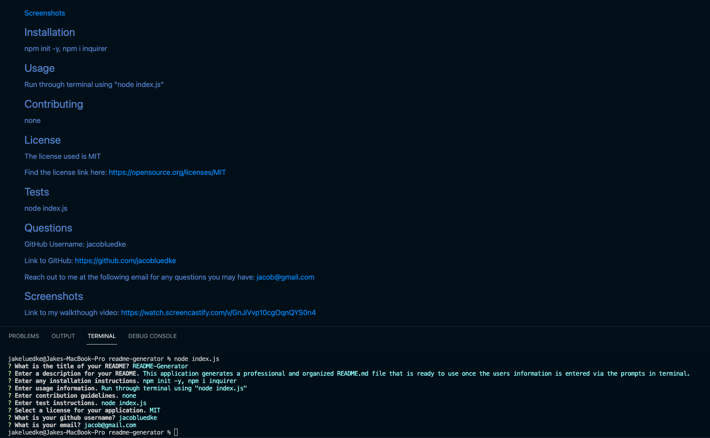
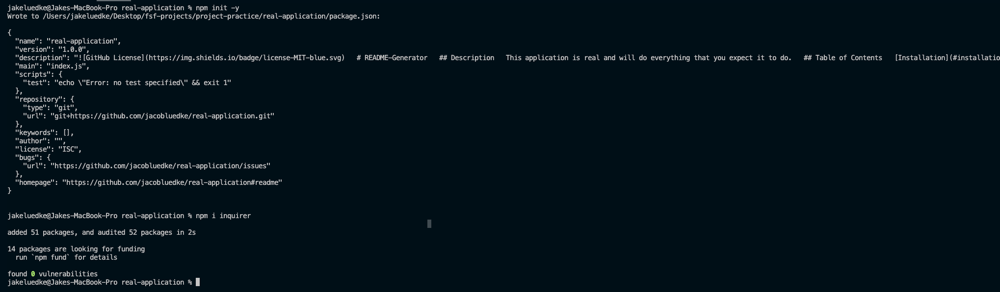

  
  # README-Generator
  ## Description
  This application generates a professional and organized README.md file that is ready to use once the users information is entered via the prompts in terminal. The items in the table of contents are clickable and will take you to that section of the README file. The license, github and walkthrough links are all clickable and will take you to the agreement, github page, and video respectively. There is also a space left for screenshots if you would like to add them for your application. This README file was created using the generator.
  ## Table of Contents
  [Installation](#installation)

  [Usage](#usage)

  [Contributing](#contributing)

  [License](#license)

  [Tests](#tests)

  [Questions](#questions)

  [Screenshots](#screenshots)
  
  ## Installation
  npm init -y, npm i inquirer
  ## Usage
  Run through terminal using "node index.js"
  ## Contributing
  none
  ## License
  The license used is MIT

  Find the license link here: [https://opensource.org/licenses/MIT](https://opensource.org/licenses/MIT)
  ## Tests
  node index.js
  ## Questions
  GitHub Username: jacobluedke

  Link to GitHub: [https://github.com/jacobluedke](https://github.com/jacobluedke)

  Reach out to me at the following email for any questions you may have: jacob@gmail.com
  ## Screenshots

  
  

  Link to my walkthough video: [https://watch.screencastify.com/v/GnJiVvp10cgOqnQYS0n4](https://watch.screencastify.com/v/GnJiVvp10cgOqnQYS0n4)

